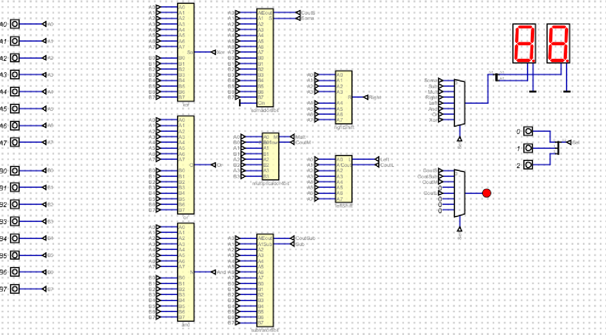

# Ponderada ALU
&emsp; Este repositório contém a execução e demonstração da ponderada da semana &, construção de uma ALU (Unidade Lógica Aritmética)

## Vídeo demonstrativo
A seguir está um vídeo demontrativo do projeto desenvolvido 

[Vídeo explicativo](https://youtu.be/9r6lxBq7IvY)

&emsp; Os arquivos com a execução de cada um dos componentes da ALU, como somador, subtrator, multiplicador e operações como XOR, OR e AND se encontram na pasta arquivos.

